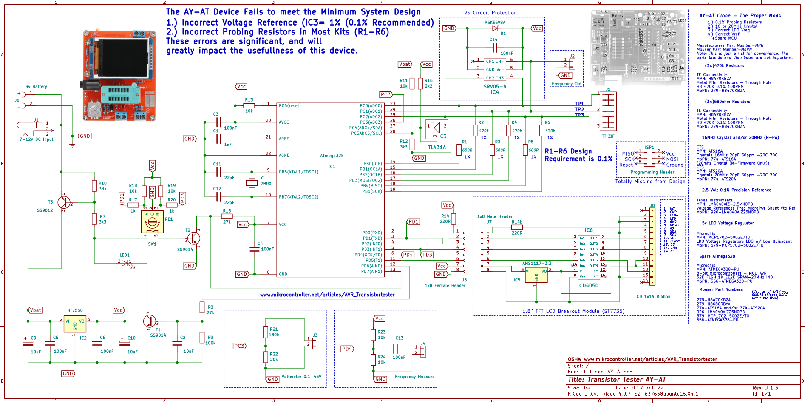
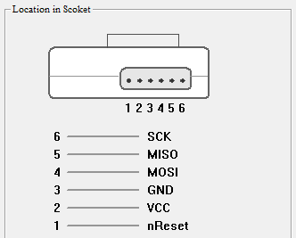

# transistor-tester

Documentation of my modifications to the [AVR Transistortester](https://www.mikrocontroller.net/articles/AVR_Transistortester).

A transistor tester is a device where you can insert different kinds of electronic components and have them analyzed. It not only reads transistors and tells you whether it's NPN or PNP, but it tells you the resistance of resistors or capacitance of capacitors, and more. There are many different types, and they are usually very cheap. 

I have the [GM328 kit from Banggood](https://www.banggood.com/DIYAssembled-GM328-Transistor-Tester-Diode-Capacitance-LCR-Generator-With-Case-Kit-p-1163916.html?ID=530527&cur_warehouse=CN). It's usually called AY-AT instead, as it's not really a GM328.


Notable hardware:

* ATmega328P with 8MHz crystal
* ST7735 160x128px screen
* Rotary encoder
* 5.5mm x 2.1mm center positive barrel jack for 9V
* Terminals for frequency generator, frequency counter and voltage reader
* ZIF socket for analyzing components
* Holtek HT7550-1 voltage regulator
* WS TL431AA voltage reference


## Modifications

To improve the accuracy of the tester there are some simple modifications you can do.



(Image from https://github.com/Upcycle-Electronics/AVR-Transistor-Tester)

See also [this post on eevblog](https://www.eevblog.com/forum/testgear/$20-lcr-esr-transistor-checker-project/msg1286025/#msg1286025).

From the [readme of the k-firmware](https://github.com/madires/Transistortester-Warehouse/blob/master/Documentation/ttester-1.13k.English.pdf):

"_The resistors R1 to R6 are critical for measurements and this 680Ω and 470kΩ resistors should be
 measurement type resistors (tolerance of 0.1%) to get the full accuracy._"
 
"_The additional 2.5V precision voltage reference connected at pin PC4 (ADC4) can be used to check and calibrate the VCC voltage, but is not required. You can use a LM4040-AIZ2.5 (0.1%), a LT1004CZ-2.5 (0.8%) or a LM336-Z2.5 (0.8%) as voltage reference. If you don’t install the precision voltage reference and you don’t add the relay extension, you should install a pull up resistor R16 to PC4 with a higher resistance value (47kΩ). This helps the software to detect the missing voltage reference._"

From the [readme of the m-firmware](https://github.com/madires/Transistortester-Warehouse/blob/master/Documentation/ctester-1.39m.English.pdf):
 
"_The external 2.5V voltage reference should be only enabled if it's at least 10 times more precise than the voltage regulator. Otherwise it would make the results worse. If you're using a MCP1702 with a typical tolerance of 0.4% as voltage regulator you really don't need a 2.5V voltage reference._"
 
 The part about R16 in the readme of the k-firmware is confusing since it's not mentioned in the readme of the m-firmware. [This post](https://www.eevblog.com/forum/testgear/$20-lcr-esr-transistor-checker-project/msg3005468/#msg3005468) confirms that it's only necessary for the k-firmware:
 
"_For running the m-firmware you can skip step #3 or remove R16 (no need to replace it). When HW_REF25 is disabled (default setting) the firmware will ignore any external voltage reference. The k-firmware handles external references a little different and always checks for a 2.5V reference (no setting to disable that). Therefore the k-firmware needs the resistor mod (step #3) to make it believe that there isn't any reference._"

I chose to order 0.1% resistors and just the MCP1702 voltage regulator, skipping the voltage reference. Also added a 16MHz crystal for increased speed:
 
* 3x [TE Connectivity H8470KBZA - Metal Film Resistor 470K 0.1%](https://www.mouser.com/ProductDetail/279-H8470KBZA)
* 3x [TE Connectivity H8680RBYA - Metal Film Resistor 680R 0.1%](https://www.mouser.com/ProductDetail/279-H8680RBYA) 
* 1x [Microchip MCP1702-5002E/TO - LDO Voltage Regulator 5V 250mA 0.1%](https://www.mouser.com/ProductDetail/579-MCP1702-5002E-TO)  
* 1x [IQD LFXTAL003240 - 16MHz Quartz](https://www.mouser.com/ProductDetail/LFXTAL003240Bulk) 

The concrete changes, referenced to the schematics:

* Y1: 16MHz crystal instead of 8Mhz
* R1, R3, R5: 680R 0.1% tolerance instead of 1%
* R2, R4, R6: 470k 0.1% tolerance instead of 1%
* IC2: MCP1702 high precision voltage regulator instead of HT7550 low precision voltage regulator. Pin compatible.
* IC3: TL431A voltage reference is not necessary because of MCP1702.
* R16: Due to missing voltage reference, this 2k2 resistor is not necessary with the m-firmware.

This is how it looks with these changes in place:


The 0.1% resistors (black) are a bit thicker than the default (blue), so they overlap a little bit.


## Firmware

There are 2 different firmware choices for the transistor tester. The original is the k-firmware. The tester comes with version 1.12k (quite old), and the newest is 1.13k. Development of the k-firmware is currently on hold. It's been forked into the m-firmware, which is rewritten and with additional features, and still under active development.

The k-firmware source is available [here](https://www.mikrocontroller.net/svnbrowser/transistortester/Software/trunk/), with precompiled firmware for the AY-AT in the [mega328_color_kit](https://www.mikrocontroller.net/svnbrowser/transistortester/Software/trunk/mega328_color_kit/) directory. There is also a Makefile there with the correct parameters. The source of the m-firmware is available [here](https://www.mikrocontroller.net/svnbrowser/transistortester/Software/Markus/), but only as tarballs. There are no precompiled versions. Both firmwares can also be found [here](https://github.com/madires/Transistortester-Warehouse/tree/master/Firmware).

I chose to use the m-firmware, due to it still being actively developed. The newest version at the time of writing is 1.39m.


### Configuration

There are 3 configuration files in the firmware that needs to be adjusted. See the file "Clones" (from the firmware tgz) for the basic changes required to build a compatible firmware for the AY-AT. The additional changes I made are documented here. The files are also available in the [firmware](firmware) directory.


##### config.h 

* Disabled `HW_REF25` because I don't use the TL431A voltage reference or the recommended LM4040 replacement.
* Disabled `SW_IR_RECEIVER` because the firmware was too large (105%) and wouldn't fit on the ATmega328P. The support for IR is not important to me so it was ok to disable.
* Enabled `UI_AUTOHOLD` because continuous test mode was annoying. I'd rather take the time I need to read the result.
* Enabled `POWER_OFF_TIMEOUT` so it turns off when idle.
* Enabled `SW_POWER_OFF` so I can turn it off from the menu.


##### config_328.h

* Enabled `LCD_LATE_ON` because the screen is very garbled when initialized and this setting makes it look fine.


##### Makefile

* Changed `FREQ` to 16 because of my change from 8 to 16MHz crystal.


##### Tip for unmodified AY-AT

If you just want to build a new firmware, and don't care for any of the hardware modifications described here you can follow the configuration examples with the following exceptions:

* Enable `HW_REF25`
* Keep `FREQ` set to 8

This will give you a firmware that runs on a "stock" GM328 AY-AT from Banggood.


### Building

In addition to the build tools that was already installed, I had to add the following packages (in openSUSE):

* `avr-libc`
* `cross-avr-gcc9`

Then `make` to build.

When build is finished you should have these files, which make up the firmware:

* `ComponentTester.eep`
* `ComponentTester.hex`

And the compiler output should end with something like this:

```
AVR Memory Usage
----------------
Device: atmega328

Program:   32234 bytes (98.4% Full)
(.text + .data + .bootloader)

Data:        248 bytes (12.1% Full)
(.data + .bss + .noinit)

EEPROM:      738 bytes (72.1% Full)
(.eeprom)
```

If any of these are more than 100% full you have too much enabled in the firmware and it will not work.


### Flash firmware

To flash the firmware we need 3 files. The 2 firmware-files from above, and [ComponentTester.cfg](firmware/ComponentTester.cfg). The last file contains the configuration of the fuses of the ATmega328P. The fuse configuration is extracted from the Makefile. To see what the fuses mean you can use this [online calculator](http://www.engbedded.com/fusecalc/).

The AY-AT does not support firmware flashing out of the box. There are 2 ways around that.


#### 1. Use a chip programmer with a ZIF socket

The first option requires no more modfications to the transistor tester, but you have to remove the chip from the socket and insert it into the programmer every time you want to update the firmware.

I use a [TL866II Plus](http://www.xgecu.com/en/TL866_main.html) universal programmer together with the [minipro](https://gitlab.com/DavidGriffith/minipro/) open source software for Linux. See https://github.com/blurpy/minipro for more about how to use.

With the chip in the programmer, just run these commands:

* Erase chip: `minipro -p "ATMEGA328P@DIP28" -E`
* Write eeprom: `minipro -p "ATMEGA328P@DIP28" -c data -w ComponentTester.eep -e`
* Write flash: `minipro -p "ATMEGA328P@DIP28" -c code -w ComponentTester.hex -e`
* Write fuses: `minipro -p "ATMEGA328P@DIP28" -c config -w ComponentTester.cfg -e`

That should be it.


#### 2. Add In Circuit Serial Programming (ICSP) header pins

The other option is to solder pins on the back of the circuit board to add the missing ICSP header that lets you flash the firmware in circuit. More work up front, but very useful if you update the firmware often.

I added right angle header pins like this:


This is the pinout (mirrored compared to above): 


There are many different devices that can be used to flash with an ICSP header, like [this example](https://www.eevblog.com/forum/testgear/$20-lcr-esr-transistor-checker-project/msg1021401/#msg1021401) using an Arduino Uno as the programmer, but I'll be using the TL866II Plus mentioned above, as it also supports ICSP mode, with the following pinout:



With wires hooked up between the transistor tester (with power removed) and the programmer, just run these commands:

* Erase chip: `minipro -p "ATMEGA328P@DIP28" -E -i`
* Write eeprom: `minipro -p "ATMEGA328P@DIP28" -c data -w ComponentTester.eep -e -i`
* Write flash: `minipro -p "ATMEGA328P@DIP28" -c code -w ComponentTester.hex -e -i`
* Write fuses: `minipro -p "ATMEGA328P@DIP28" -c config -w ComponentTester.cfg -e -i`

That should be it.


#### Result

This is the finished result after flashing the new firmware:


### Restore original firmware

You can find the original firmware [here](firmware/original) if you want to restore to a known working firmware.


## Troubleshooting


### Flashing white screen

I initially didn't pay any attention to the output after the compile step:

```
AVR Memory Usage
----------------
Device: atmega328

Program:   34784 bytes (106.2% Full)
```

It worked fine to flash the firmware, however when trying to start the tester it would quickly flash white on the screen and then turn off. I thought it was a hardware issue at first, but when testing the original firmware it worked. After disabling enough features in this firmware to get below 100% memory it worked fine as well.


### Persistent white screen

When I forgot to configure the screen in `config_328.h` before compiling and flashing, the tester would turn on and display a white screen until power was removed. Easily fixed by adding the correct configuration and trying again.


## Calibration

It's recommended to follow the steps described in the readme to run a self test and adjustment. When asked to short the probes I used short breadboard wire between test point 1 and test point 2, and between test point 2 and test point 3 in the ZIF socket. Remember to save from the menu afterwards.
